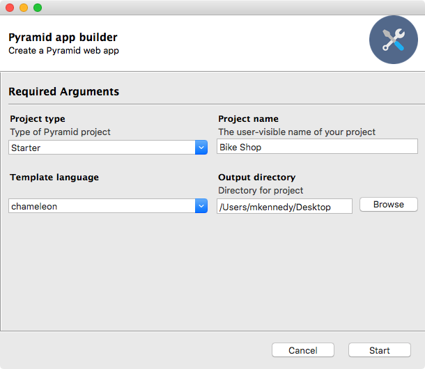

# Pyramid web builder Python GUI

This project bundles all the cookiecutter templates
for creating Pyramid-based web apps into a simple UI.

It's a cool example of a simple and clean Python GUI app
that runs on macOS, Windows, and Linux.

To run the app, just:

1. Clone the repo
2. Create a virtual environment based on **Python 3**
3. In `app` folder: `pip install -r requirements`
4. Run `program.py`: `python program.py`

Want to try creating an app (still buggy), use PyInstaller in the `app` folder:

1. `pip install pyinstaller`
2. `pyinstaller build.spec`